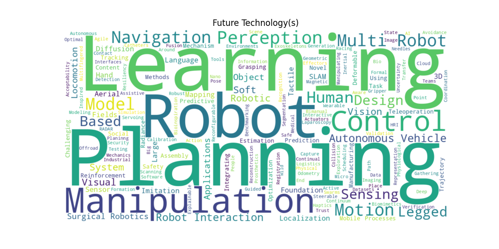
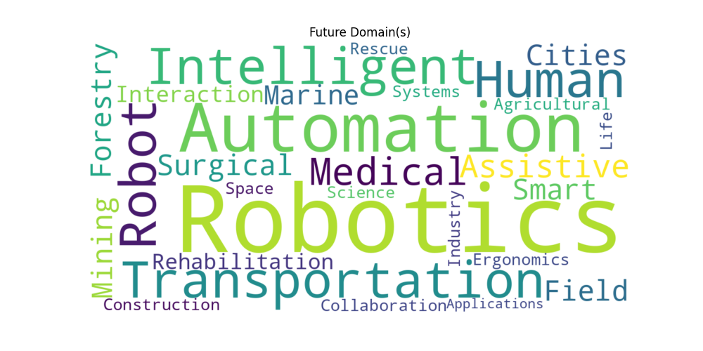
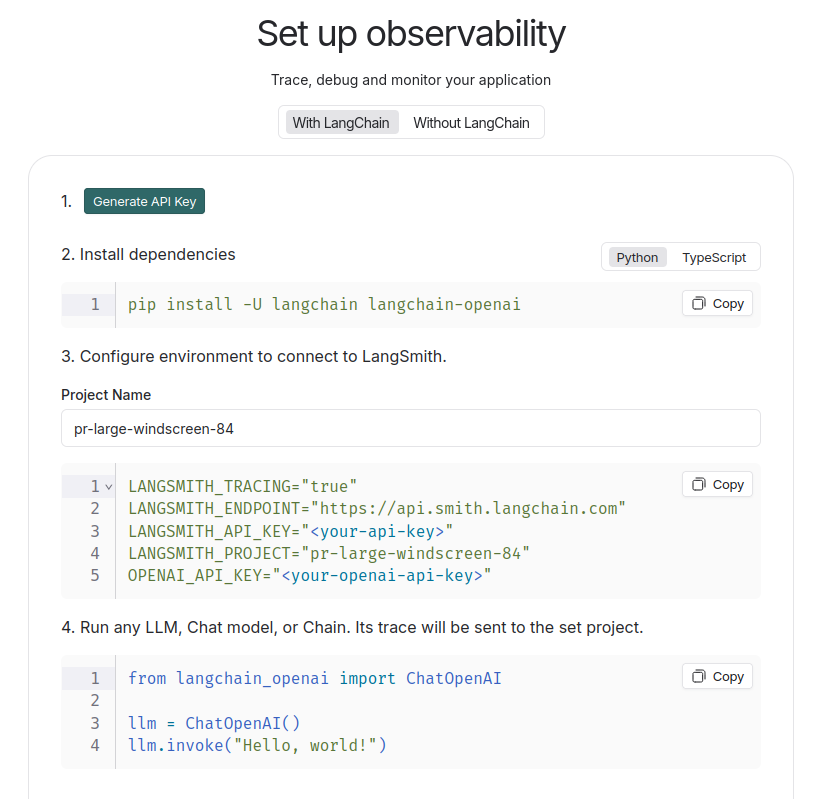

# Tech Trend Analysis [WIP]
A repo that accepts a list of websites and .pdf documents, parses them using an LLM to determine relevant past, present and future trends, and then generates a report and wordcloud for the user.

Features integration with LangChain for tracing and analysis.




This is a work in progress, but feel free to raise an issue in the meantime if you're interested.

# Setup
## Prerequisites
This assumes you are using a Unix-style OS and was developed on Ubuntu 24.04.

This also assumes you have [Conda](https://docs.conda.io/projects/conda/en/latest/user-guide/install/index.html) (or alternatively, [Mamba](https://mamba.readthedocs.io/en/latest/installation/mamba-installation.html)) installed for Python environment management. `conda` and `mamba` can be used interchangeably.

## Create mamba environment
mamba env create -f env.yml

## Set your environment variables
Modify the included `.env_example` with your LangChain and Google AI credentials.

To do this, you'll need to generate a new tracing project in LangSmith, and copy the generated project name and key at this screen:


Google AI credentials can be found in [Google AI Studio](https://aistudio.google.com/app/apikey). This can be modified for OpenAI, but I began with Google for development.

Save the updated file as `.env`; it will automatically be loaded by the scripts later on.

## Update the data sources
Modify the sample `data/sample_sources.yaml` file as needed. Some example .pdf documents and websites are provided.

## Installation

# Usage

```
mamba activate tech_trend_analysis
python3 main.py # The standalone script, which generates the wordcloud image and a report
python3 main.py -c config/default.yaml
python3 main.py -c config/dev.yaml # Use a custom config file for development
streamlit run streamlit_app.py # The streamlit browser app version
```

# Future Work
- Modularity fixes
- CONCEPT TREES! Nest sub-concepts (e.g. Learning for Control, Learning for Vision) under main concepts (Learning)
- Implement OpenAI function calls and example files
- Take year of publication into account for temporal context