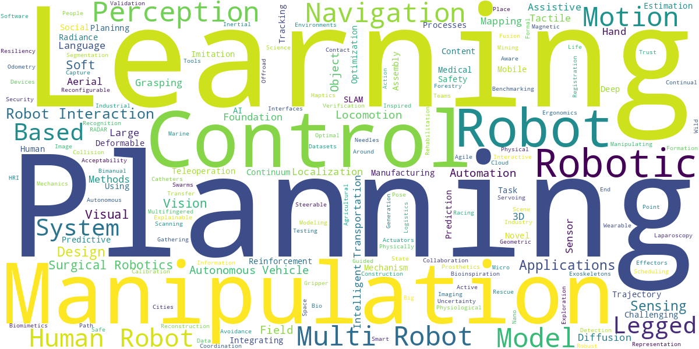
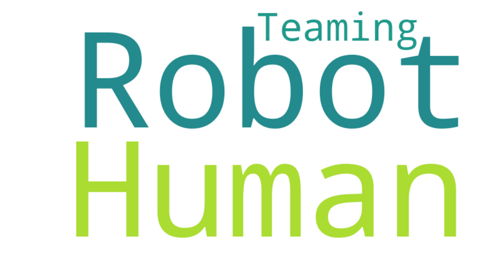

# Tech Trend Analysis [WIP]
A repo that accepts a list of websites and .pdf documents, parses them using an LLM to determine relevant past, present and future trends, and then generates a report and wordcloud for the user.

Features integration with LangChain for tracing and analysis.




This is a work in progress, but feel free to raise an issue in the meantime if you're interested.

# Setup
## Create mamba environment
mamba env create -f env.yml

## Set your environment variables
Modify the included `.env_example` with your LangChain and Google AI credentials, and save the updated file as `.env`.

## Update the data sources
Modify the `data/sources.yaml` file as needed. Some example .pdf documents and websites are provided.

# Usage
```
mamba activate tech_trend_analysis
python3 main.py # The standalone script, which generates the wordcloud image and a report
streamlit run streamlit_app.py # The streamlit browser app version
```
